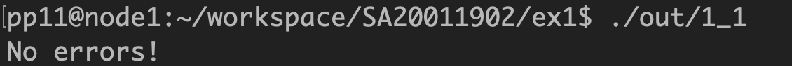
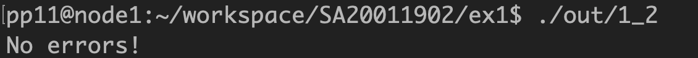
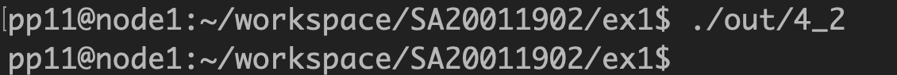
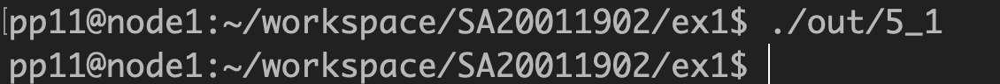

# 一、

## 1.

&emsp;&emsp; 语句对自身有流依赖关系，方向向量为(1,1)，因此内层可以并行化。使用`parallel for`对内层循环并行化，并行部分的代码为：

```c
    /* Parallel program */
    for (i = 2; i <= 10; i++) {
        omp_set_num_threads(NUM_THREADS);
#pragma omp parallel for private(j)
        for (j = 2; j <= 10; j++) {
            A[i][j] = (A[i - 1][j - 1] + A[i + 1][j + 1]) / 2;
            if (A[i][j] != A_copy[i][j]) raise_errors = 1;
        }
    }
```

其中`raise_errors`用来记录并行计算时是否有数组与串行计算结果不同。

```c
   /* Check if there exists any error */
    if (raise_errors)
        printf("Errors!");
    else
        printf("No errors!");

    return 0;
```

程序最终运行结果为



可见并行化后计算结果是正确的。

## 2

&emsp;&emsp; 语句对自身有流依赖，但距离向量是 2，因此可以每两个循环（偶数 i 和 i+1）为一组，组内可以并行化计算，但粒度较小，组间串行计算。同样使用`parallel for`对包括两个循环的组进行并行化，关键部分代码如下：

```c
   /* Parallel program */
    omp_set_num_threads(NUM_THREADS);
    for (i = 2; i <= 20; i += 2) {
#pragma omp parallel for private(j)
        for (j = i; j <= i + 1; j++) {
            if (j > 20) continue;
            A[2 * i + 2] = A[2 * i - 2] + B[i];
            if (A[2 * i + 2] != A_copy[2 * i + 2]) raise_errors = 1;
        }
    }
```

同样用`raise_errors`来记录是否有错误，最终程序运行结果如下。



## 3

&emsp;&emsp; 尽管是 if-else 语句，但上面的语句有可能依赖上一个循环的下面的语句且距离为 1. 但有些特殊情况会使这种依赖关系消失，例如数组 A 前 k 项都是正数，这样会使第循环 k 之前所有的循环都执行上面的语句，若 A 剩下的项都是负数，则可以保证后面的循环都执行下面的语句。两个语句不会交替出现，则就没有依赖关系了。

&emsp;&emsp;对数组 A 的初始化代码如下

```c
for (i = 0; i < 21; i++) {
        if (i < 13)
            A[i] = A1[i] = 1;
        else
            A[i] = A1[i] = -1;
        B[i] = B1[i] = i * i;
        C[i] = C1[i] = 3 * i;
    }
```

这样一来，循环就可以并行化，并行化计算的函数如下

```c
void parallel(int *A, int *B, int *C) {
    int i;
    omp_set_num_threads(NUM_THREADS);
#pragma omp parallel for private(i)
    for (i = 2; i <= 20; i++)
        if (A[i] > 0)
            B[i] = C[i - 1] + 1;
        else
            C[i] = B[i] - 1;
}
```

`check_correctness`函数作用是检查串行和并行计算结果有无不同，具体代码如下

```c
/* Check if there is any difference between two arrays */
int check_correctness(int *A, int *A1) {
    int i, raise_errors = 0;
    for (i = 0; i < 21; i++)
        if (A[i] != A1[i]) raise_errors = 1;
    return raise_errors;
}
```

最终程序的运行结果如下


，可见并行化结果是正确的。但一般情况此循环不可并行化。

# 二、

## 1.

&emsp;&emsp;语句自身对自身有流依赖关系，方向向量为(1,1)，因此内层循环可以并行化。并行部分代码如下

```c
    for (i = 1; i <= M; i++) {
        omp_set_num_threads(NUM_THREADS);
#pragma omp parallel for private(j)
        for (j = 1; j <= N; j++) {
            A[i + 1][j + 1] = A[i][j] + C;
            if (A[i + 1][j + 1] != A1[i + 1][j + 1]) raise_errors = 1;
        }
    }

```

最终程序运行结果如下


可见并行化计算结果是正确的。

## 2

&emsp;&emsp;语句 S2 和 S3 相互依赖，而 S4 依赖 S3，S1 依赖 S4，因此可以改变语句顺序。最外层循环串行，里面有语句 S2，S3，S4.其中 S2 和 S3 在第二层循环也串行计算，但语句 S3 涉及的第三层循环可以并行化。在 S2 与 S3 在第二层循环串行计算结束后，可以对语句 S4 进行第二层循环并行化计算。在最外层循环结束后，S2、S3、S4 计算结束，最后可对语句 S1 的循环进行并行化。并行部分代码如下

```c
/* Parallel computing */
void parallel(int* X, int* Y, int A[][101], int* B, int C[][101]) {
    int i, j, k;
    for (i = 1; i <= 100; i++) {
        for (j = 1; j <= 100; j++) {
            B[j] = A[j][N];
            omp_set_num_threads(NUM_THREADS);
#pragma omp parallel for private(k)
            for (k = 1; k <= 100; k++) A[j + 1][k] = B[j] + C[j][k];
        }

        omp_set_num_threads(NUM_THREADS);
#pragma omp parallel for private(j)
        for (j = 1; j <= 100; j++) Y[i + j] = A[j + 1][N];
    }

    omp_set_num_threads(NUM_THREADS);
#pragma omp parallel for private(i)
    for (i = 1; i <= 100; i++) X[i] = Y[i] + 10;
}
```

然后根据串行计算的结果检验所有数组是否有计算错误，涉及的代码段有

```c
    /* Check if there is any error */
    int X_error = check_correctness1(X, X1, 101);
    int Y_error = check_correctness1(Y, Y1, 201);
    int B_error = check_correctness1(B, B1, 101);
    int A_error = check_correctness2(A, A1, 102);

    if (X_error) printf("ERRORS in X!");
    if (Y_error) printf("ERRORS in Y!");
    if (A_error) printf("ERRORS in A!");
    if (B_error) printf("ERRORS in B!");
```

其中两个查错函数`check_correctness1`和`check_correctness2`都是检验并行计算结果和串行计算结果的两个数组是否存在不想等的元素。最终终端没有打印出任何错误，证明并行化的计算结果是正确的。

# 三、

## 1.

&emsp;&emsp;作业第 3 小问已经证明存在方向向量为(0,1)的流依赖，因此内层循环不可并行化。同时也可证存在方向向量为(1,\*)的依赖关系，则两个循环都不能被并行化，因此此程序不可被并行化。

## 2.

&emsp;&emsp;S2, S3 和 S4 之间有相互依赖关系，而 S5 与这三个语句没有依赖关系。因此可以使用`parallel sections`编译制导来划分两个并行 section，其中一个 section 为{S2, S3, S4}，另一个 section 为{S5}. 两个 section 内部都只能串行计算，而两个 section 可以并行计算。串行计算代码为

```c
/* Parallel computing */
void parallel(int x, int y, int z, int* A, int* B, int* C, int D[][51]) {
    int i, j;
    x = y * 2;
    omp_set_num_threads(NUM_THREADS);
#pragma omp parallel sections private(i, j)
    {
#pragma omp section
        for (i = 1; i <= 100; i++) {
            C[i] = B[i] + x;
            A[i] = C[i - 1] + z;
            C[i + 1] = A[i] * B[i];
        }

#pragma omp section
#pragma omp parallel for private(i, j)
        for (i = 1; i <= 100; i++)
            for (j = 1; j <= 50; j++) D[i][j] = D[i][j - 1] + x;
    }

    z = y + 4;
}
```

查错方式同上上题，最终没有打印出错误语句，因此并行化的计算结果是正确的。


# 四、

## 1.

&emsp;&emsp;这个语句的(i, j)个循环流依赖于循环(i - 1, j)以及循环(i, j - 1)，证明方向向量为(0, 1)和(1, 0)，因此内外层循环均不可并行化。

## 2.

&emsp;&emsp;这个语句存在流依赖关系，距离向量为 3，因此可以做粒度为 3 的并行化处理。并行计算代码如下

```c
    /* Parallel computing */
    omp_set_num_threads(NUM_THREADS);
    for (i = 1; i <= 16; i += 3)
#pragma omp parallel for private(j)
        for (j = i; j <= i + 2; j++)
            if (j <= 16) {
                A[j + 3] = A[j] + B[j];
                if (A[j + 3] != A1[j + 3]) printf("ERROR in %d\n", j);
            }
```

程序运行结果为

没有打印错误警告，因此并行化计算是正确的。

## 3.

&emsp;&emsp;本题程序只是上题程序的另一种写法，因此并行化的方法和代码与上个程序相同。如下图所示，同样没有打印错误语句，并行化处理正确。


# 五、

## 1.

&emsp;&emsp;设程序中四个语句分别为 S, T, U, V. 其中 T 和 U 之间有相互的流依赖关系，S 流依赖与 T，V 流依赖与 U，因此可以先串行计算语句 T 和 U，然后用`parallel sections`来并行计算 S 和 V。其中 S 和 V 内部也可以对循环进行并行化，用到的制导是`parallel for`。整个并行化处理的代码如下

```c
    /* Parallel computing */
    for (i = 1; i <= 100; i++) {
        B[i] = C[i - 1] * 2;
        C[i] = 1 / B[i];
        if (B[i] != B1[i]) printf("ERROR in B[%d]\n", i);
        if (C[i] != C1[i]) printf("ERROR in C[%d]\n", i);
    }

    omp_set_num_threads(NUM_THREADS);
#pragma omp parallel sections
    {
#pragma omp section
#pragma omp parallel for private(i)
        for (i = 1; i <= 100; i++) {
            A[i] = A[i] + B[i - 1];
            if (A[i] != A1[i]) printf("ERROR in A[%d]\n", i);
        }

#pragma omp section
#pragma omp parallel for private(i)
        for (i = 1; i <= 100; i++) {
            D[i] = C[i] * C[i];
            if (D[i] != D1[i]) printf("ERROR in D[%d]\n", i);
        }
    }
```

程序运行结果如下图所示



同样没有打印错误提示，因此并行化处理策略是正确的。

## 2.

&emsp;&emsp;记上下两个语句分别为 S 和 T，其中 T 流依赖于 S，而 S 也可能反依赖于 T。当 i < 500 时，999 - i + 1 > 500; 当 i > 500 时，999 - i + 1 < 500。因此可把循环拆成 1-499 和 500-999，且先执行 1-499 部分。并行代码如下

```c
    /* Parallel computing */
    omp_set_num_threads(NUM_THREADS);
#pragma omp parallel for private(i)
    for (i = 1; i <= 499; i++) {
        A[i] = B[i] + C[i];
        if (A[i] != A1[i]) printf("ERROR in A[%d]\n", i);
    }
#pragma omp parallel for private(i)
    for (i = 1; i <= 499; i++) {
        D[i] = (A[i] + A[999 - i + 1]) / 2;
        if (D[i] != D1[i]) printf("ERROR in D[%d]\n", i);
    }
#pragma omp parallel for private(i)
    for (i = 500; i <= 999; i++) {
        A[i] = B[i] + C[i];
        if (A[i] != A1[i]) printf("ERROR in A[%d]\n", i);
    }
#pragma omp parallel for private(i)
    for (i = 500; i <= 999; i++) {
        D[i] = (A[i] + A[999 - i + 1]) / 2;
        if (D[i] != D1[i]) printf("ERROR in D[%d]\n", i);
    }
```

程序运行结果如下


没有打印错误提示，因此可见并行化处理方法是正确的。

## 3.

&emsp;&emsp;作业中已经分析证明了不同循环之间语句没有任何依赖关系，因此可以对两层循环都进行并行化，并行处理代码如下

```c
    /* Parallel computing */
    omp_set_num_threads(NUM_THREADS);
#pragma omp parallel for private(i, j)
    for (i = 1; i <= 100; i++)
#pragma omp parallel for private(j)
        for (j = 1; j <= 100; j++) {
            A[3 * i + 2 * j][2 * j] = C[i][j] * 2;
            if (A[3 * i + 2 * j][2 * j] != A1[3 * i + 2 * j][2 * j])
                printf("ERROR in A[%d][%d]\n", i, j);
            if (i - j + 6 >= 0) {
                D[i][j] = A[i - j + 6][i + j];
                if (D[i][j] != D1[i][j]) printf("ERROR in D[%d][%d]\n", i, j);
            }
        }
```

程序运行结果如下所示


可见并行化处理方法是正确的。
