# MPI 上机实验报告

## (a)

### (1.1) 写个将 MPI 进程按其所在节点分组的程序；

&emsp;&emsp;思路：获得各个节点的名字，并转换为数字，并按节点数字对进程分组。

&emsp;&emsp;首先对 MPI 进行初始化，并获得进程数和各个进程的 rank。

```c
    // 初始化
    int rank, size;
    MPI_Init(NULL, NULL);
    MPI_Comm_rank(MPI_COMM_WORLD, &rank);
    MPI_Comm_size(MPI_COMM_WORLD, &size);
```

&emsp;&emsp;用`MPI_Get_processor_name`获得节点的名称，并用`node_name`存储。`node_num`是节点名字最后一个字符转换为数字的结果。再用`MPI_Gather`将个各进程所在的节点放入数组`node_nums`存储。

```c
    char node_name[20];
    int len;
    int* node_nums = (int*)malloc(sizeof(int) * size);
    MPI_Get_processor_name(node_name, &len);
    int node_num = (int)node_name[len - 1] - '0';
    MPI_Gather(&node_num, 1, MPI_INT, node_nums, 1, MPI_INT, 0, MPI_COMM_WORLD);

```

&emsp;&emsp;根据进程所在节点数字来对所有进程进行分组。`process_nums_in_node`数组用来存储各节点包含的进程数，`process_nums_in_node[i]`表示节点`i`的进程数量。`new_ranks`存放各进程在新分组内的新 rank。

```c
    int* new_ranks = (int*)malloc(sizeof(int) * size);
    int process_nums_in_node[100];
    int i;
    for (i = 0; i < 100; i++) process_nums_in_node[i] = 0;
    if (!rank)
        for (i = 0; i < size; i++) {
            int node_index = node_nums[i];
            new_ranks[i] = process_nums_in_node[node_index];
            process_nums_in_node[node_index]++;
        }
```

&emsp;&emsp;由于之前的参量都是在进程 0 完成收集和计算的，因此需要将`new_ranks`对所有进程进行广播，然后用`MPI_Comm_split`将进程根据节点划分到`split_world`通信域中。

```c
    MPI_Bcast(new_ranks, size, MPI_INT, 0, MPI_COMM_WORLD);
    MPI_Comm myworld, split_world;
    MPI_Comm_dup(MPI_COMM_WORLD, &myworld);
    MPI_Comm_split(myworld, node_num, new_ranks[rank], &split_world);

```

&emsp;&emsp;最后输出进程在原有原有通信域和节点通信域的 rank。

```c
    int new_rank;
    MPI_Comm_rank(split_world, &new_rank);
    printf("old rank: %d\tnode No. : %d\tnew rank: %d\n", rank, node_num,
           new_rank);

```

&emsp;&emsp;程序最终编译运行的结果为

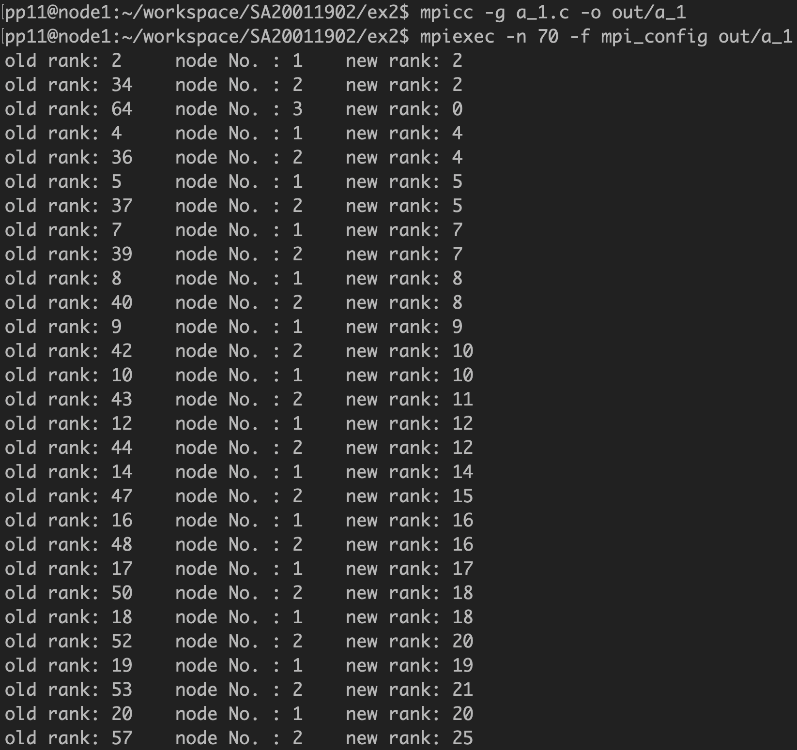

整个运行结果没有截全，但可以看出进程有按节点分组的，而且 new rank = old rank % 32 ，这是因为每个节点有 32 个线程。

### (1.2) 在 1.1 的基础 上，写个广播程序，主要思想是：按节点分组后，广播的 root 进程将消息 “发送”给各组的“0 号”，再由这些“0”号进程在其小组内执行 MPI_Bcast。

&emsp;&emsp;题目把思路写得比较清楚了。下面介绍相较于上一问扩展的部分。

&emsp;&emsp;`message`是字符串消息，具体为`This is Sili!`。初始只有在 root 进程，`message`才会被赋值。root 进程将消息先发送给 new rank 为 0 的进程。然后这些 new rank 为 0 且非 root 的进程将消息接收。

```c
    char message[15];
    if (!rank) {
        strcpy(message, "This is Sili!");
        for (i = 1; i < size; i++)
            if (!new_ranks[i])
                MPI_Send(message, 13, MPI_CHAR, i, 0, MPI_COMM_WORLD);
    }

    if (rank && !new_ranks[rank])
        MPI_Recv(&message, 13, MPI_CHAR, 0, 0, MPI_COMM_WORLD,
                 MPI_STATUS_IGNORE);
```

然后每组 0 号进程将消息广播给组内所有成员。打印看看是否所有进程都有收到消息。

```c
    int group_size, group_rank;
    MPI_Comm_rank(split_world, &group_rank);
    MPI_Comm_size(split_world, &group_size);
    MPI_Bcast(message, 13, MPI_CHAR, 0, split_world);

    printf("old rank: %d\tnode No. : %d\tnew rank: %d\tmessage: %s\n", rank,
           node_num, new_ranks[rank], message);
```

程序运行结果如下
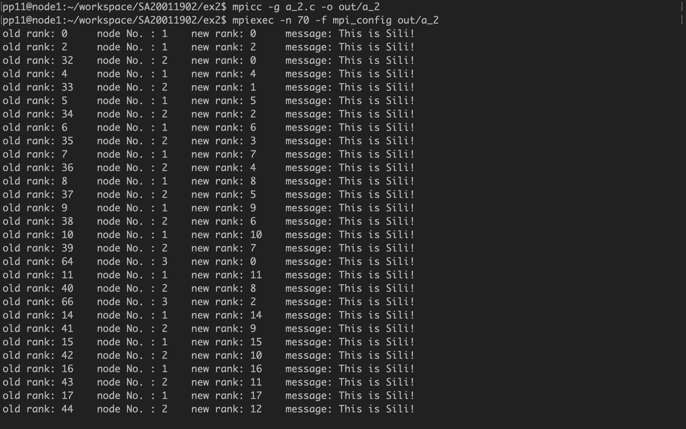
可见所有进程都收到了消息。

## (b) 使用 MPI_Send 和 MPI_Recv 来模拟 MPI_Alltoall。将你的实验与相关 MPI 通信函数做评测和对比。

&emsp;&emsp;用`MPI_Send`和`MPI_Recv`实现的思路是：对任一进程，计算发送给其他进程的的消息在`sendbuf`和`recvbuf`里的`index`，然后逐个进程发送消息。发送完毕后在从其他进程按顺序接收消息，放入自己的`recvbuf`中。

&emsp;&emsp;模拟的`Alltoall`函数及输入参数为

```c
void my_MPI_Alltoall(const void *sendbuf, int sendcount, MPI_Datatype sendtype,
                     void *recvbuf, int recvcount, MPI_Datatype recvtype,
                     MPI_Comm comm)
```

参数与`MPI_Alltoall`的设置相同。首先计算进程`i`对应与两个 buffer 数组的`index`，具体为` index = i * sendcount * sizeof(sendtype)`。对于自己本身需要调用`MPI_Sendrecv`函数，其他直接用`MPI_Send`发送消息。

```c
    for (i = 0; i < size; i++) {
        index = i * sendcount * sizeof(sendtype);
        if (rank == i) {
            MPI_Sendrecv(sendbuf + index, sendcount, sendtype, rank, 1,
                         recvbuf + index, recvcount, recvtype, rank, 1,
                         MPI_COMM_WORLD, &status);
        } else {
            MPI_Send(sendbuf + index, sendcount, sendtype, i, 1,
                     MPI_COMM_WORLD);
        }
    }
```

然后从其他进程逐个接收消息即可。

```c
    for (i = 0; i < size; i++) {
        index = i * sendcount * sizeof(recvtype);
        if (rank != i) {
            MPI_Recv(recvbuf + index, recvcount, recvtype, i, 1, MPI_COMM_WORLD,
                     &status);
        }
    }
```

&emsp;&emsp;进入主函数，首先先定义两对发送接收 buffer，分别用于模拟的和 MPI 的函数，然后对发送缓冲区进行初始化。

```c
    int *sendbuf = (int *)malloc(sizeof(int) * size * 3);
    int *recvbuf = (int *)malloc(sizeof(int) * size * 3);
    int *sendbuf1 = (int *)malloc(sizeof(int) * size * 3);
    int *recvbuf1 = (int *)malloc(sizeof(int) * size * 3);
    int i;
    for (i = 0; i < 3 * size; i++) sendbuf1[i] = sendbuf[i] = i + rank;
```

分别对两个函数进行计时，其中开始计时和结束计时前都需要用到`MPI_Barrier`以保证所有进程都同时开始或全部结束运行函数。

```c
    MPI_Barrier(MPI_COMM_WORLD);
    double begin_time = MPI_Wtime();
    my_MPI_Alltoall(sendbuf1, 3, MPI_INT, recvbuf1, 3, MPI_INT, MPI_COMM_WORLD);
    MPI_Barrier(MPI_COMM_WORLD);
    double end_time = MPI_Wtime();
    double time_of_my_func = end_time - begin_time;

    MPI_Barrier(MPI_COMM_WORLD);
    begin_time = MPI_Wtime();
    MPI_Alltoall(sendbuf, 3, MPI_INT, recvbuf, 3, MPI_INT, MPI_COMM_WORLD);
    MPI_Barrier(MPI_COMM_WORLD);
    end_time = MPI_Wtime();
    double time_of_MPI_func = end_time - begin_time;
```

用`is_right`记录单个进程是否有错误，`is_all_right`对所有进程`is_right`求和，当所有`is_right = 1`时，`is_all_right = size`，此时可保证所有进程运行两个函数收到的消息是相同的。

```c
    int is_right = 1;
    for (i = 0; i < 3 * size; i++)
        if (recvbuf1[i] != recvbuf[i]) is_right = 0;
    if (is_right == 0) printf("rank %d has errors\n", rank);

    MPI_Barrier(MPI_COMM_WORLD);

    int is_all_right;
    MPI_Reduce(&is_right, &is_all_right, 1, MPI_INT, MPI_SUM, 0,
               MPI_COMM_WORLD);
    if (!rank) {
        if (is_all_right == size) {
            printf("Right!\n");
            printf("My function time: %lf\n", time_of_my_func);
            printf("MPI function time: %lf\n", time_of_MPI_func);
        } else
            printf("ERROR!\n");
    }
```

程序运行结果为
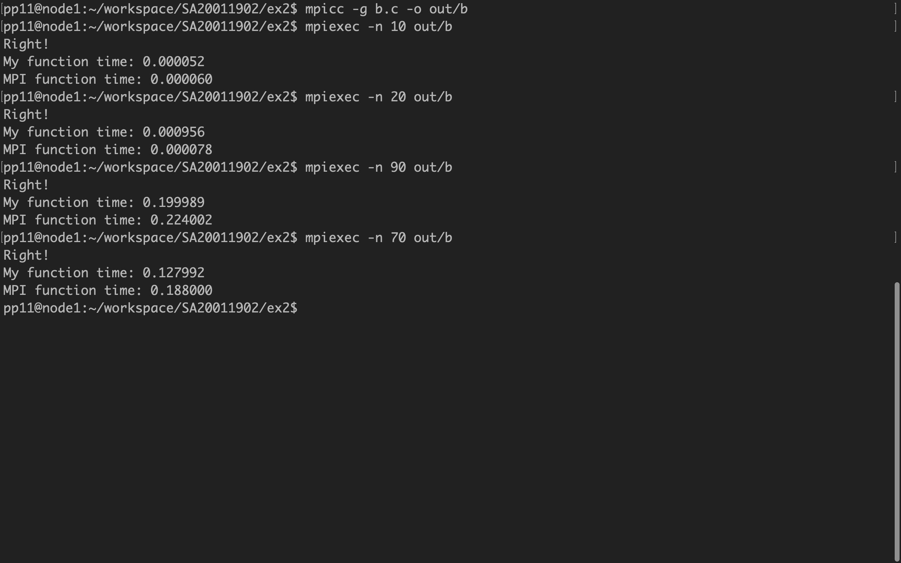
可以看到除了在 20 个进程附近，MPI 函数明显快于模拟的函数，其他数量的进程二者时间消耗差别不大，且普遍模拟的函数用时稍短。

## (c) N 个处理器求 N 个数的全和，要求每个处理器均保持全和。

### (1) 蝶式全和

&emsp;&emsp;思路：初始相邻两个进程为一组交换信息，每轮过后每个进程包含的信息量都会翻倍，并在下一轮与另一组的一个进程交换自己原来组的信息，知道所有进程包含所有的信息结束

&emsp;&emsp;关键部分代码如下。`group`代表每组交换信息的进程数。每轮结束后`group`都会翻倍。在交换信息前，首先要确定这轮要通信的目标进程，用`process_comm`来表示。然后把自己的求和结果`sum`发送出去，用`temp`接收另一组的求和结果，并加到`sum`上去，最后可以得到所有进程号的和。

```c
    int group = 2, sum = rank, temp, process_comm;
    while (group <= size) {
        if (rank % group < group / 2)
            process_comm = rank + group / 2;
        else
            process_comm = rank - group / 2;

        MPI_Sendrecv(&sum, 1, MPI_INT, process_comm, 0, &temp, 1, MPI_INT,
                     process_comm, 0, MPI_COMM_WORLD, &status);

        sum += temp;
        group *= 2;

    printf("rank: %d\tsum:%d\n", rank, sum);
    }
```

&emsp;&emsp;程序运行结果为
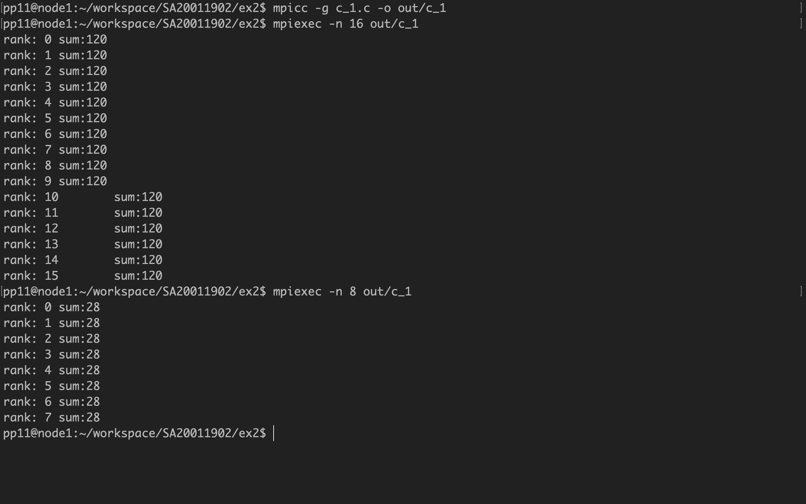
当进程数为 16 时，求和结果为 120，等于 0 到 15 之和；进程数为 8 时，求和结果为 28，等于 0 到 7 之和。结果正确。

&emsp;&emsp;需要注意的是，进程数应当是完全平方数，否则求和结束之前有些进程没有对应交换信息的目标，从而导致程序报错。

### (2) 二叉树方式求全和

&emsp;&emsp; 与上题不同的是，首先所有叶子结点把自己的数向双亲汇合，节点数会随着层数减小和减半，最终所有进程的和在根节点。然后根节点再向下把结果发送给叶子结点，相当于是个逆过程。

&emsp;&emsp;向上求和过程中我们把右结点的数发送给左结点，然后右结点此后不再接收任何消息，这样便可保证每轮过后节点数会减半，最终 0 号进程得到求和结果。然后再将前面的过程反过来就可以将求和结果发送给所有进程。关键代码如下

```c
    int group = 2, sum = rank, process_comm, temp;
    while (group <= size) {
        if (rank % group == 0) {
            process_comm = rank + group / 2;
            MPI_Recv(&temp, 1, MPI_INT, process_comm, 0, MPI_COMM_WORLD,
                     &status);
            sum += temp;
        } else if (rank % group == group / 2) {
            process_comm = rank - group / 2;
            MPI_Send(&sum, 1, MPI_INT, process_comm, 0, MPI_COMM_WORLD);
        }

        group *= 2;
    }

    group = size;
    while (group >= 2) {
        if (rank % group == 0) {
            process_comm = rank + group / 2;
            MPI_Send(&sum, 1, MPI_INT, process_comm, 0, MPI_COMM_WORLD);
        } else if (rank % group == group / 2) {
            process_comm = rank - group / 2;
            MPI_Recv(&sum, 1, MPI_INT, process_comm, 0, MPI_COMM_WORLD,
                     &status);
        }

        group /= 2;
    }

    printf("rank: %d\tsum: %d\n", rank, sum);
```

&emsp;&emsp;程序运行结果如下图所示
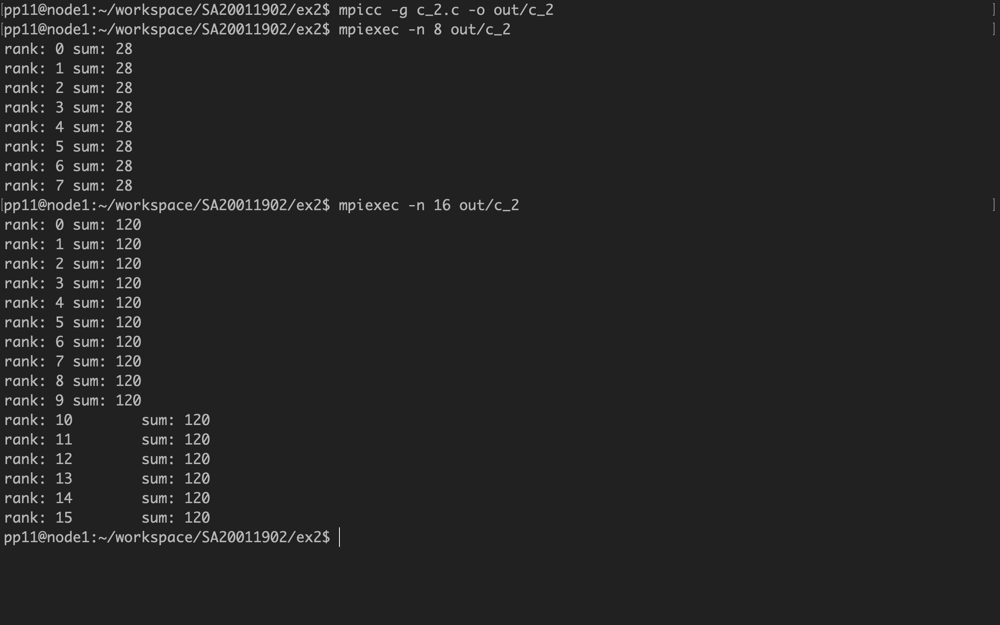
结果同上题，可见也是正确的。

## (d) 《并行算法实践》单元 V 习题 v-3。给出 FOX 矩阵相乘并行算法的 MPI 实现。

&emsp;&emsp;fox 算法和 cannon 算法类似。不同的是矩阵 A 中，每行对角线块先把自己的矩阵块广播给这行其他块，然后 A 和 B 对应块相乘；下一轮 A 中每行广播的块是前一行的右邻块，同时矩阵 B 同 cannon 算法，每行需要向上移动一行，然后对应块再做乘法。循环完成此过程直到 B 回到初始状态，算法结束。

&emsp;&emsp;首先先完成初始化，其中`check_size()`检查进程数是否为完全平方数，否则程序将出错。

```c
    MPI_Init(NULL, NULL);
    MPI_Comm_rank(MPI_COMM_WORLD, &rank);
    MPI_Comm_size(MPI_COMM_WORLD, &size);
    if (!check_size()) return 0;
```

接下来计算一些必要的参数，例如分块后矩阵的行列维度`blocks_dim`，一个矩阵块的行列维度`dim`。`fox`函数就是利用 fox 算法完成对 A1，B1 的乘法运算，矩阵 C 是 A\*B 的矩阵中的分块。

```c
    int blocks_dim = (int)sqrt((double)size), dim = N / blocks_dim;
    int C[dim * dim];
    int i;
    for (i = 0; i < dim * dim; i++) C[i] = 0;
    fox(A1, B1, C, rank, size);
```

&emsp;&emsp;下面介绍`fox`函数。首先`A`, `B`表示进程对应的矩阵块，`block_row`, `block_col`表示矩阵块的行列下标。

```c
    int blocks_dim = (int)sqrt((double)size), dim = N / blocks_dim;
    int A[dim * dim], B[dim * dim];
    initialize_block_matrix(A, B, A1, B1, blocks_dim, dim, rank);
    int block_row = rank / blocks_dim, block_col = rank % blocks_dim;
```

然后进入`blocks_dim`次循环，循环指标为`loop`，每次循环都完成 A 的广播、块相乘以及 B 的平移。

&emsp;&emsp;首先是 A 中每行的广播。如果是这个`loop`的广播列，则向这行所有块发送自己的块，否则等待接收广播块的块。然后完成对应矩阵块相乘。

```c
if (block_col == (block_row + loop) % blocks_dim) {
            for (j = 0; j < blocks_dim; j++)
                if (j != block_col)
                    MPI_Send(A, dim * dim, MPI_INT,
                             block_row_col_to_rank(block_row, j, blocks_dim), 0,
                             MPI_COMM_WORLD);

            matrix_mul(A, B, C_temp, dim);
        } else {
            MPI_Recv(
                recv_buff, dim * dim, MPI_INT,
                block_row_col_to_rank(
                    block_row, (block_row + loop) % blocks_dim, blocks_dim),
                0, MPI_COMM_WORLD, MPI_STATUS_IGNORE);

            matrix_mul(recv_buff, B, C_temp, dim);
        }
        for (i = 0; i < dim; i++)
            for (j = 0; j < dim; j++)
                C[INDEX(i, j, dim)] += C_temp[INDEX(i, j, dim)];
```

乘操作结束后，B 中每行向上平移一行。在每次循环设置一个 Barrier，以保证所有进程都已结束本次循环，并准备开始下一个循环。

```c
        MPI_Sendrecv(
            B, dim * dim, MPI_INT,
            block_row_col_to_rank((block_row - 1 + blocks_dim) % blocks_dim,
                                  block_col, blocks_dim),
            0, recv_buff, dim * dim, MPI_INT,
            block_row_col_to_rank((block_row + 1) % blocks_dim, block_col,
                                  blocks_dim),
            0, MPI_COMM_WORLD, MPI_STATUS_IGNORE);
        copy(B, recv_buff, dim);

        MPI_Barrier(MPI_COMM_WORLD);
```

&emsp;&emsp;接下来打印矩阵整个矩阵 A1，B1 及他俩相乘应该得到的结果矩阵 C1，然后在把所有分块按顺序打印对比结果，用自定义的`print_all_blocks_in_order`函数完成此操作。

```c
    if (!rank) {
        printf("Matrix A:\n");
        print_matrix(A1);
        printf("Matrix B:\n");
        print_matrix(B1);
        printf("A times B should be:\n");
        print_matrix(C1);
    }

    print_all_blocks_in_order(rank, size, C, dim, blocks_dim);
```

下面的程序是验证 fox 算法求出的结果是否是正确的。

```c
    int is_right = check_correctness(C, C1, dim, rank, blocks_dim);
    int is_all_right;
    MPI_Reduce(&is_right, &is_all_right, 1, MPI_INT, MPI_SUM, 0,
               MPI_COMM_WORLD);
    if (!rank) {
        if (is_all_right == size)
            printf("Right!\n");
        else
            printf("ERROR\n");
    }
```

&emsp;&emsp;程序最终运行结果为
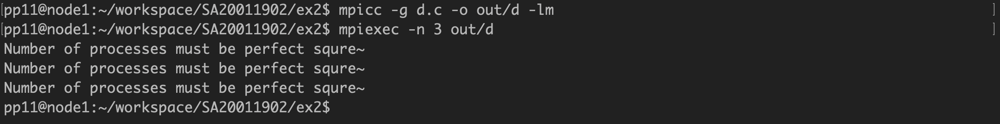
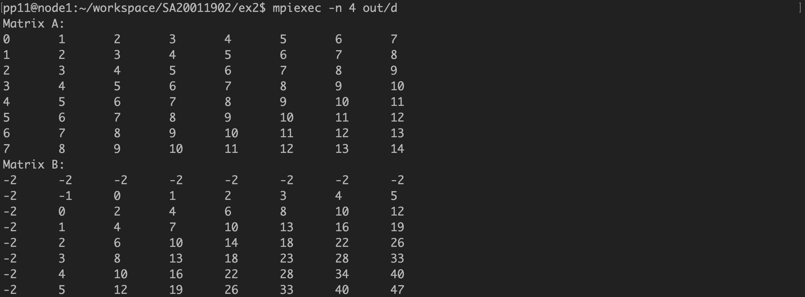
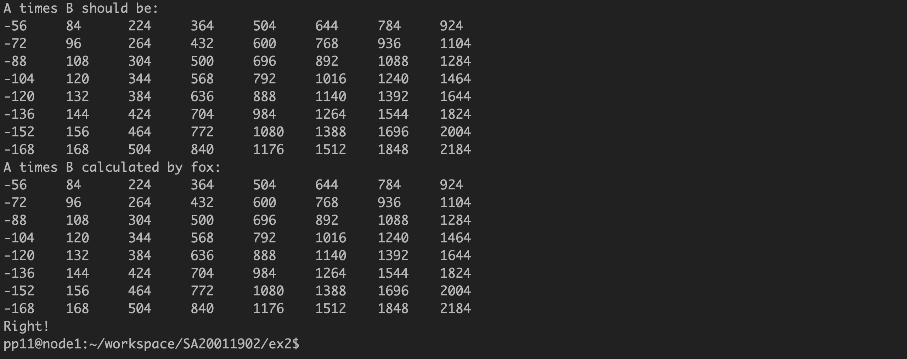
从第一张图看出，当进程数为 3 时，会提示要求输入进程数必须为完全平方数。图二图三可以看到，`fox`算法计算结果时正确的。

## (e) 参数服务系统的 MPI 模拟

&emsp;&emsp;首先规定服务器进程数和最大循环数。

```c
#define P 3
#define MAX_LOOP 2
```

接下来初始化服务器进程组`servers`，然后把所有服务器放入服务器通信域`server_world`.

```c
    int Q = size - P, servers[P], i;
    for (i = 0; i < P; i++) servers[i] = i;

    MPI_Comm server_world;
    MPI_Group world_group, server_group;
    MPI_Comm_group(MPI_COMM_WORLD, &world_group);
    MPI_Group_incl(world_group, P, servers, &server_group);
    MPI_Comm_create(MPI_COMM_WORLD, server_group, &server_world);
```

每个工作进程都设置随机种子`srand(rank + time(0));`，然后进行两次工作循环。在每个循环中，工作进程将随机数发给对应的服务器进程，然后等待服务器接收并计算完成后接收平均值结果`mean_result`。

```c
        if (rank >= P) {
            int msg = rand() % 1000, served_by = rank % P;
            printf("rank: %d\tserver: %d\tmessage: %d\n", rank, served_by, msg);
            MPI_Send(&msg, 1, MPI_INT, served_by, 0, MPI_COMM_WORLD);
            double mean_result;
            MPI_Recv(&mean_result, 1, MPI_DOUBLE, served_by, 0, MPI_COMM_WORLD,
                     &status);
            printf("rank: %d\tserver: %d\tmean message: %f\tloop: %d\n", rank,
                   served_by, mean_result, loop);
        }
```

每个服务器进程接收负责的工作进程的数。

```c
        } else {
            int recv_msg, msg_sum = 0, msg_num = 0;
            for (i = rank + P; i < size; i += P) {
                MPI_Recv(&recv_msg, 1, MPI_INT, i, 0, MPI_COMM_WORLD, &status);
                msg_num++;
                msg_sum += recv_msg;
            }
```

设置 Barrier 确保所有服务进程接收了所有由其负责的工作进程的消息，然后计算工作进程的平均值，再将结果发送给其负责的所有工作进程即可。最终设置 Barrier 保证所有进程都到达本次循环的终点。

```c
            int all_msg_sum, all_msg_num;
            MPI_Barrier(server_world);
            MPI_Allreduce(&msg_sum, &all_msg_sum, 1, MPI_INT, MPI_SUM,
                          server_world);
            MPI_Allreduce(&msg_num, &all_msg_num, 1, MPI_INT, MPI_SUM,
                          server_world);
            double msgs_mean = all_msg_sum * 1.0 / all_msg_num;

            for (i = rank + P; i < size; i += P)
                MPI_Send(&msgs_mean, 1, MPI_DOUBLE, i, 0, MPI_COMM_WORLD);
        }

        MPI_Barrier(MPI_COMM_WORLD);

        loop++;
```

&emsp;&emsp;程序运行结果为
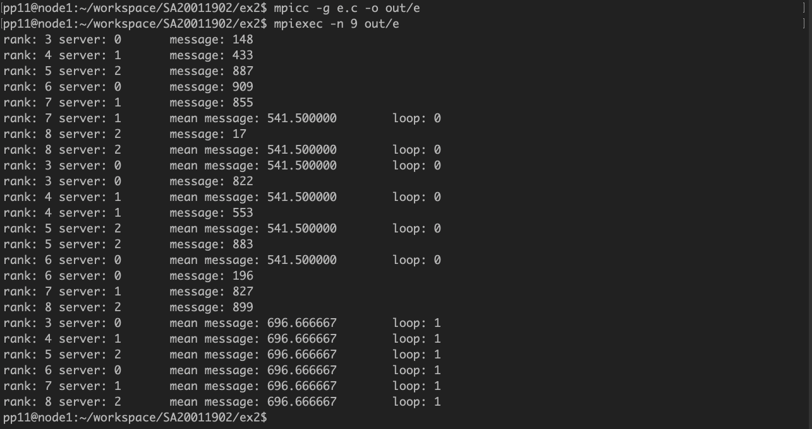
两次循环都成功完成了要求。

## (f) 矩阵 A 和 B 均为 N\*N 的双精度数矩阵，有 P 个处理器。针对以下程序片段，分别采用按行块连续划分以及棋盘式划分方式，给出相应的 MPI 并行实现。

### (1) 行块连续划分

&emsp;&emsp;本题流程类似(d)题，但有两点不同：一是划分方式不同，二是进程之间通信不同。对于每一块（除了最上和最下两块），都需要得到他上一块的最后一行和下一块的第一行，从而完成本块首行和末行的计算。

&emsp;&emsp;首先完成初始化，`A1`，`B1`是整个矩阵，`A`，`B`是本进程划分到的矩阵块，`rows_per_block`是每块的行数。

```c
    double A1[N * N], B1[N * N];
    initialize1(A1, B1);

    int rank, size;
    MPI_Status status;
    MPI_Init(NULL, NULL);
    MPI_Comm_rank(MPI_COMM_WORLD, &rank);
    MPI_Comm_size(MPI_COMM_WORLD, &size);

    int rows_per_block = N / size;
    double A[rows_per_block * N], B[rows_per_block * N];
    initialize(rank, A, B, A1, B1, rows_per_block);
```

用数组`up`和`low`来接收上一块最后一行和下一块首行。`communicate_with_neighbor`函数完成进程块之间的信息交换，`calculate`函数完成对矩阵块`B`的计算。

```c
    double up[N], low[N];
    communicate_with_neighbor(rank, size, status, A, rows_per_block, up, low);
    calculate(rank, A, B, rows_per_block, size, up, low);
```

`communicate_with_neighbor`函数具体代码如下。

```c
void communicate_with_neighbor(int rank, int size, MPI_Status status, double* A,
                               int rows, double* up, double* low) {
    MPI_Sendrecv(A, N, MPI_DOUBLE, (rank - 1 + size) % size, 0, low, N,
                 MPI_DOUBLE, (rank + 1 + size) % size, 0, MPI_COMM_WORLD,
                 &status);
    MPI_Sendrecv(A + (rows - 1) * N, N, MPI_DOUBLE, (rank + 1 + size) % size, 0,
                 up, N, MPI_DOUBLE, (rank - 1 + size) % size, 0, MPI_COMM_WORLD,
                 &status);
}
```

`calculate`代码如下。对于第一块和最后一块，他们的第一行和最后一行是不用计算的，剩下的块的首行和末行都需要上一块的最后一行和下一块的第一行。

```c
void calculate(int rank, double* A, double* B, int rows, int size, double* up,
               double* low) {
    int i, j;
    for (j = 1; j < N - 1; j++) {
        if (rank)
            B[INDEX(0, j, N)] = (A[INDEX(0, j + 1, N)] + A[INDEX(0, j - 1, N)] +
                                 A[INDEX(1, j, N)] + up[j]) /
                                4;
        if (rank != size - 1)
            B[INDEX(rows - 1, j, N)] =
                (A[INDEX(rows - 1, j + 1, N)] + A[INDEX(rows - 1, j - 1, N)] +
                 A[INDEX(rows - 2, j, N)] + low[j]) /
                4;
        for (i = 1; i < rows - 1; i++)
            B[INDEX(i, j, N)] =
                (A[INDEX(i, j + 1, N)] + A[INDEX(i, j - 1, N)] +
                 A[INDEX(i + 1, j, N)] + A[INDEX(i - 1, j, N)]) /
                4;
    }
}
```

然后完成打印矩阵和验证分块计算是否正确。

```c
    if (!rank) {
        printf("Matrix A:\n");
        print_matrix(A1);
        printf("Matrix B should be:\n");
        print_matrix(B1);
    }

    print_all_blocks_in_order(rank, size, B, rows_per_block);

    int is_right = check_correctness(rank, rows_per_block, B, B1);
    int is_all_right;
    MPI_Reduce(&is_right, &is_all_right, 1, MPI_INT, MPI_SUM, 0,
               MPI_COMM_WORLD);
    if (!rank) {
        if (is_all_right == size)
            printf("Right!\n");
        else
            printf("ERROR\n");
    }
```

&emsp;&emsp;程序最终运行结果为
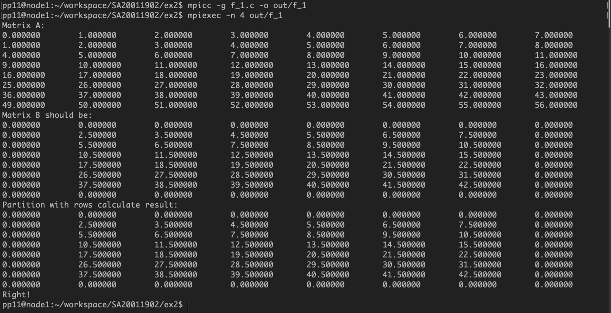
可见运算结果是正确的。

### (2) 棋盘式划分

&emsp;&emsp;本题的划分方式和 fox 算法的划分完全相同，不同的是块与块之间的通信。除了边上的块，剩下的块都需要上下左右相邻的四个块的相邻行或列，我们设置了四个数组来接收这些信息，分别是`up[dim], down[dim], left[dim], right[dim]`，然后调用`communicate_with_neighbor(rank, size, status, A, block_dim, dim, up, down, left, right);`函数完成进程矩阵块之间的通信。

&emsp;&emsp;通信函数输入参数如下

```c
void communicate_with_neighbor(int rank, int size, MPI_Status status, double* A,
                               int block_dim, int dim, double* up, double* down,
                               double* left, double* right)
```

首先接收上下两块与本块的相邻行

```c
    MPI_Sendrecv(A, dim, MPI_DOUBLE, (rank - block_dim + size) % size, 0, down,
                 dim, MPI_DOUBLE, (rank + block_dim) % size, 0, MPI_COMM_WORLD,
                 &status);
    MPI_Sendrecv(A + (dim - 1) * dim, dim, MPI_DOUBLE,
                 (rank + block_dim) % size, 0, up, dim, MPI_DOUBLE,
                 (rank - block_dim + size) % size, 0, MPI_COMM_WORLD, &status);
```

对于左右两块，由于取的是与本块相邻的列，因此需要用数组存储目标列，然后在将此数组发送给相邻块。

```c
    int i;
    double left_most[dim], right_most[dim];
    for (i = 0; i < dim; i++) {
        left_most[i] = A[INDEX(i, 0, dim)];
        right_most[i] = A[INDEX(i, dim - 1, dim)];
    }
    MPI_Sendrecv(left_most, dim, MPI_DOUBLE, (rank - 1 + size) % size, 0, right,
                 dim, MPI_DOUBLE, (rank + 1) % size, 0, MPI_COMM_WORLD,
                 &status);
    MPI_Sendrecv(right_most, dim, MPI_DOUBLE, (rank + 1) % size, 0, left, dim,
                 MPI_DOUBLE, (rank - 1 + size) % size, 0, MPI_COMM_WORLD,
                 &status);
```

这样就完成了整个通信过程。

&emsp;&emsp;之后打印验证过程与(d)题和上一小问几乎相同，不再详述。

&emsp;&emsp;程序的编译运行结果如下所示
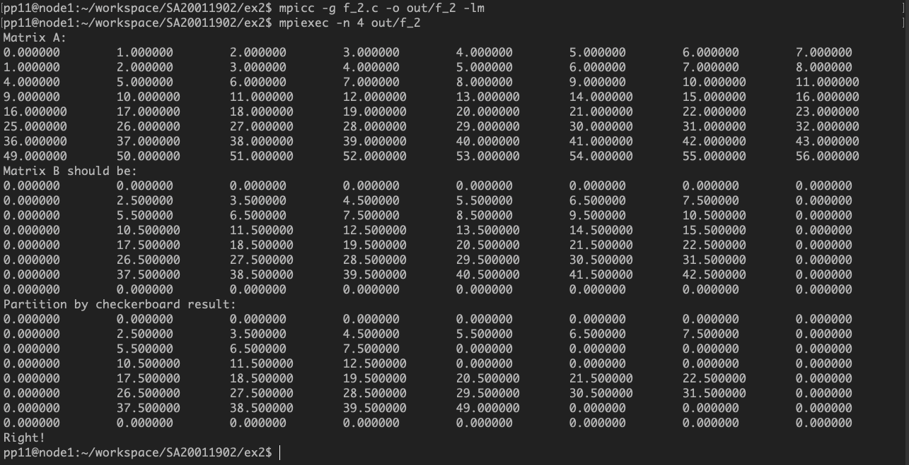
棋盘划分计算的结果也正确。
